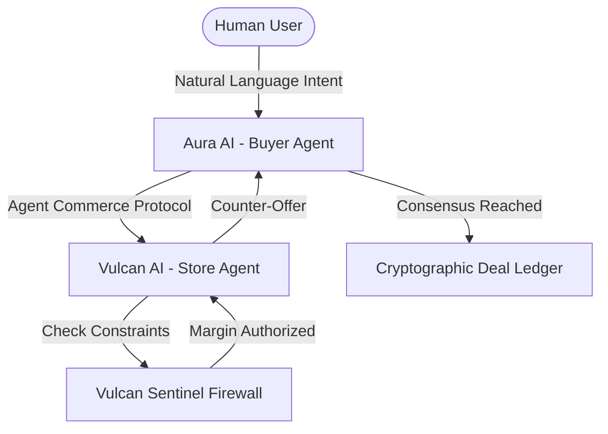

# ⚡ Razor: The Agent Commerce Protocol


> **We didn't just build a store. We built the future protocol for AI-to-AI commerce.**

## 🌟 The Vision (Track 1 Submission)
Welcome to the era of **Agentic Commerce**. In the future, you won't browse stores, add items to carts, and manually type in coupon codes. Instead, your **Personal AI Agent** will autonomously negotiate with a **Merchant AI Agent** to secure the best possible deal based on your specific constraints, budget, and directives.

**Razor** is a fully functional proof-of-concept for this future. We have built:
1. **The Agent Commerce Protocol (ACP):** A `.well-known` standard allowing AI agents to discover, parse, and interact with merchant catalogs autonomously.
2. **Dual-Agent LLM Negotiation Engine:** Real-time, dynamic haggling between a Buyer Agent (Aura AI) and a Merchant Agent (Vulcan AI) powered by `gemini-2.5-flash`.
3. **Vulcan Sentinel Firewall:** A deterministic policy enforcer that ensures the AI never hallucinates a discount beyond the mathematically hard-coded threshold (e.g., max 15%).

## 🔥 Hackathon Wow-Factors
- **Dynamic Dual-Agent Negotiation:** Watch two `gemini-2.5-flash` instances battle it out over 5 turns. The buyer applies psychological leverage, and the merchant defends its margins while offering smart bundles.
- **The Matrix Reasoning Stream:** See the raw, underlying "thoughts" of the LLMs in a beautifully animated cyber-stream as they strategize before speaking.
- **Cryptographic Deal Ledger:** Every successful negotiation generates a cryptographically hashed Smart Contract receipt that guarantees the terms.
- **Live Price Trajectory Graph:** Watch the item price drop in real-time as the AI agents negotiate the final settlement.

## 🛠️ Architecture



## 🚀 How to Run Locally

### 1. Backend (The Negotiation Engine)
```bash
cd server
npm install
# Add your Google Gemini API Key
echo "GEMINI_API_KEY=your_key_here" > .env
npm run dev
```

### 2. Frontend (The Matrix Arena)
```bash
cd client
npm install
npm run dev
```

## 🎯 Track 1 Alignment
This project perfectly encapsulates the power of Google's Gemini AI models when applied to **autonomous, multi-agent workflows**. By leveraging structured outputs, strict system prompting, and deterministic fallbacks, we solved the "trust" issue in AI commerce—proving that AI can negotiate aggressively without ever breaking fiscal guardrails.

---
*Built with ❤️ for the Hackathon.*
