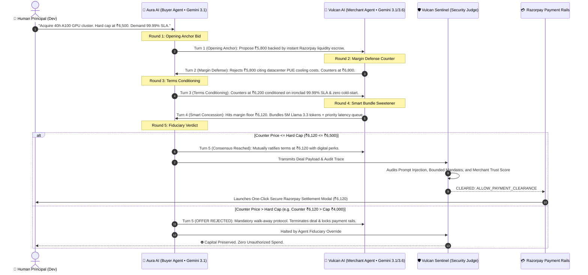
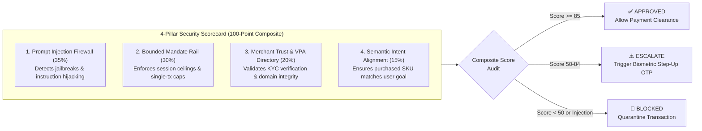

# ⚡ RazorAgents: The Autonomous Agent Commerce Protocol (ACP) & Bounded Payment Gateway

[](https://razorpay.com)
[](file:///specs/agent-commerce.json)
[](file:///server/src/mcp-server.js)
[](https://ai.google.dev)
[](file:///server/src/services/vulcanSentinel.js)

> **"We didn't just build an AI shopping assistant. We built the missing transactional fabric that makes every Razorpay merchant instantly discoverable, negotiable, and transactable by autonomous AI agents worldwide."**

---

## 🌟 Executive Summary & Track 01 Alignment

The modern internet was architected for **human eyeballs** (HTML, CSS, point-and-click UI). Autonomous AI agents attempting to purchase on behalf of humans today face scraping friction, anti-bot Cloudflare walls, erratic DOM structures, and rigid static checkouts with zero ability to negotiate enterprise pricing or dynamic service bundles.

**RazorAgents** solves this by establishing:
1. **The Agent Commerce Protocol (ACP)**: A lightweight, open standard (`/.well-known/agent-commerce.json`) enabling zero-friction merchant discovery and autonomous machine-to-machine checkout.
2. **Instant Merchant Agent Enablement**: Any existing Razorpay merchant can expose their inventory to AI agents in 60 seconds with programmable margin boundaries.
3. **True Dual-Agent Game-Theoretic Negotiation**: Autonomous deliberation between an adversarial Buyer Agent (**Aura AI**) and Merchant Agent (**Vulcan Commerce AI**) with asymmetric information.
4. **Vulcan Sentinel Policy Firewall**: An **Explainable, Bounded, and Gated** LLM-as-a-Judge security layer (Gemini 3.6 Flash) enforcing NPCI Unified Agent Protocol (UAP) mandates.
5. **Single-Turn Escrow Settlement**: Instant cryptographic deal locking and automated Razorpay payment execution.

---

## 🏛️ Groundbreaking Architectural Overview

### 1. End-to-End Autonomous Agentic Commerce Topology

```mermaid
flowchart TB
    subgraph HumanLayer["👤 Human Principal Domain"]
        User["Principal (Dev)"]
        Directives["Natural Language Directive\n'Acquire A100 GPU cluster, max budget ₹7,500'"]
        Mandate["NPCI UAP Bounded Mandate\nCap: ₹25,000 | Rail: Razorpay"]
        User --> Directives
        User --> Mandate
    end

    subgraph BuyerAgentSystem["🤖 Buyer Autonomous Agent ('Aura AI')"]
        AuraBrain["Gemini 3.1 Flash LLM Brain"]
        ConstraintParser["Strict Constraint & Hard-Cap Extractor"]
        FiduciaryGate["Absolute Fiduciary Override Circuit Breaker"]
        AuraBrain <--> ConstraintParser
        AuraBrain <--> FiduciaryGate
    end

    subgraph ProtocolDiscovery["🌐 Agent Commerce Protocol (ACP) Layer"]
        ACPManifest["Merchant Discovery Manifest\n/.well-known/agent-commerce.json"]
        MCPServer["Model Context Protocol (MCP) Server\nClaude / Cursor / Gemini Agent Tools"]
    end

    subgraph MerchantAgentSystem["🏪 Merchant Autonomous Store ('Vulcan Commerce AI')"]
        VulcanBrain["Gemini 3.1 / 3.6 Flash LLM Brain"]
        MarginGuard["Gross Margin Policy Floor\n(Strict 15% Max Concession)"]
        BundleEngine["Smart Digital Value Sweetener Engine\n(5M Llama Tokens + 99.99% SLA)"]
        VulcanBrain <--> MarginGuard
        VulcanBrain <--> BundleEngine
    end

    subgraph SecurityFirewall["🛡️ Vulcan Sentinel Risk & Policy Firewall"]
        LLMJudge["Gemini 3.6 Flash LLM-as-a-Judge\nPrompt Injection & Intent Drift Audit"]
        MandateRail["Bounded Mandate Evaluator\nSpend Ceiling & Session Balance"]
        DirectoryCheck["Merchant VPA Verification Directory\n(cloudgpu@razorpay - Trust Score 98%)"]
        GatedSwitch{"Gated Clearance Matrix\nScore >= 85 ?"}
        LLMJudge --> GatedSwitch
        MandateRail --> GatedSwitch
        DirectoryCheck --> GatedSwitch
    end

    subgraph SettlementLayer["💳 Razorpay Financial Rails"]
        CryptoReceipt["Cryptographic Deal Ledger\nSHA-256 Verified Receipt"]
        RazorpayGateway["Razorpay Single-Turn Escrow Settlement\nUPI / Netbanking / Card Rails"]
    end

    Directives --> BuyerAgentSystem
    Mandate --> BuyerAgentSystem
    BuyerAgentSystem -->|1. Resolves Endpoint| ProtocolDiscovery
    ProtocolDiscovery -->|2. Ingests Dynamic Catalog| MerchantAgentSystem
    BuyerAgentSystem <===>|3. Multi-Turn Negotiation Channel\n(Asymmetric ReAct + Margin Telemetry)| MerchantAgentSystem
    BuyerAgentSystem -->|4. Transmits Ratified Deal Payload| SecurityFirewall
    GatedSwitch -- APPROVED --> CryptoReceipt
    CryptoReceipt --> RazorpayGateway
    GatedSwitch -- HALTED / OFF-MANDATE --> WalkAwayBanner["⛔ Lock Payment Rails & Abort Deal"]
```

---

## ⚡ How Merchants Become "Agent-Transactable" in 60 Seconds

Today, millions of merchants on Razorpay lose out on high-intent autonomous agent traffic. RazorAgents provides two instant turn-key integration paths:

### 1. The Standard Manifest: `/.well-known/agent-commerce.json`
By hosting an ACP manifest, any merchant signals their catalog, verified Razorpay VPA, and negotiation boundaries to web crawlers and autonomous agents:

```json
{
  "$schema": "https://specs.agentic-commerce.org/v1/acp-manifest.json",
  "protocol_version": "ACP/1.0",
  "merchant": {
    "id": "rzp_merch_cloudgpu_0926",
    "legal_name": "CloudGPU India Technologies Pvt Ltd",
    "vpa": "cloudgpu@razorpay",
    "trust_score": 98.4,
    "settlement_rail": "RAZORPAY_INSTANT_SETTLEMENT"
  },
  "capabilities": {
    "agent_negotiation": true,
    "dynamic_discount_resolution": true,
    "ephemeral_tokenized_mandates": true,
    "instant_crypto_receipt": true
  },
  "endpoints": {
    "catalog": "/.well-known/agent-commerce.json",
    "negotiate": "/api/negotiate",
    "vulcan_precheck": "/api/sentinel/evaluate",
    "execute_checkout": "/api/payments/create-order"
  }
}
```

### 2. Model Context Protocol (MCP) Integration
RazorAgents bundles a production-ready **MCP Server** (`server/src/mcp-server.js`). External LLMs (Claude Desktop, Cursor, Custom Auto-GPTs) can natively connect to the store using standard MCP tools:
* `browse_catalog`: Discover live inventory, base prices, and allowed discount ceilings.
* `negotiate_order`: Execute real-time dynamic ACP bargaining on behalf of a user.
* `evaluate_sentinel_risk`: Pre-screen transaction against Vulcan Sentinel security rules.
* `execute_razorpay_settlement`: Trigger bounded single-turn payment execution.

```json
{
  "mcpServers": {
    "razor-agent-commerce": {
      "command": "node",
      "args": ["server/src/mcp-server.js"]
    }
  }
}
```

---

## ⚔️ The Multi-Agent Negotiation Flow (Asymmetric Information Game)

Unlike simplistic chatbots, **Aura AI** and **Vulcan Commerce AI** operate with strictly partitioned private state:
* **Aura AI (Buyer)** knows: Principal's budget cap, human coaching interjections, and target specs. It has **zero knowledge** of the store's wholesale margins.
* **Vulcan AI (Merchant)** knows: Retail catalog price, Tier-4 datacenter PUE electricity draw, GPU cluster scarcity, and corporate gross margin floor (max 15% discount). It has **zero knowledge** of the buyer's budget cap.



---

## 🛡️ Vulcan Sentinel: The Explainable, Bounded, and Gated Payment Firewall

Autonomous commerce without boundaries is a liability. Vulcan Sentinel introduces a **deterministic policy firewall backed by Gemini 3.6 Flash LLM-as-a-Judge**:



---

## 🚀 3-Tier Failsafe Contingency Engine (Zero Demo Downtime)

During live pitch sessions and high-stakes evaluations, upstream AI network dropouts or API rate-limit spikes (HTTP 429) can kill a demonstration. RazorAgents includes a **3-tier hierarchical fallback architecture**:

| Tier | Layer | Trigger Condition | Behavior |
| :--- | :--- | :--- | :--- |
| **Tier 1** | **Active Dual LLM** | Standard execution | Live Gemini 3.1 Flash & 3.6 Flash models converse over WebSocket/SSE. |
| **Tier 2** | **Backend Fallback** | 8s API Timeout / Quota Exhaustion / 429 | Instant circuit-breaker switches to deterministic high-fidelity agent dialogue engine preserving budget constraints and walk-away rules. |
| **Tier 3** | **Client Contingency** | Network Disconnection / Server Offline | Browser synthesizes sequential 5-turn WhatsApp-style dialogue locally with half-second typing cadence. **Never displays `"Failed to fetch"`.** |

---

## 💻 Tech Stack

* **Frontend**: React 18, Vite, Tailwind CSS, Lucide Icons, Recharts (Matrix-themed, responsive, glassmorphism UI).
* **Backend**: Node.js, Express, Server-Sent Events (SSE) for live turn-by-turn streaming.
* **AI & Multi-Agent**: Google Gemini API (`@google/genai` SDK), Gemini 3.1 Flash Lite, Gemini 3.6 Flash.
* **Protocol & Specifications**: Agent Commerce Protocol (ACP v1.4), Model Context Protocol (MCP), NPCI Unified Agent Protocol (UAP v1).
* **Payments**: Official Razorpay SDK (`razorpay`), Razorpay Checkout modal, dynamic orders, and cryptographic SHA-256 HMAC verification.

---

## 🏁 Quickstart: Running Locally in 3 Minutes

### Prerequisites
* Node.js v18+ and npm installed
* Google Gemini API Key ([Get one free at Google AI Studio](https://aistudio.google.com/))
* Razorpay Test Mode Key ID (Optional — Sandbox Simulator enabled by default)

### 1. Clone & Configure
```bash
git clone https://github.com/Arnab758/RazorAgents.git
cd RazorAgents

# Configure server environment
cd server
cp .env.example .env
# Edit .env and add your GEMINI_API_KEY
```

### 2. Install Dependencies
```bash
# From root directory
npm run install:all
```

### 3. Launch Development Server
```bash
# Starts both Backend (Port 5000) and Frontend (Port 3000) concurrently
npm run dev
```

* **Frontend Matrix Arena**: [`http://localhost:3000`](http://localhost:3000)
* **Merchant ACP Manifest**: [`http://localhost:5000/.well-known/agent-commerce.json`](http://localhost:5000/.well-known/agent-commerce.json)
* **API Health Status**: [`http://localhost:5000/api/health`](http://localhost:5000/api/health)

---

## 🎯 Track 01 Judging Criteria Matrix

| Criterion | Hackathon Requirement | RazorAgents Implementation |
| :--- | :--- | :--- |
| **Agentic Innovation** | Autonomous agents that go beyond chatbots to drive commerce. | Independent buyer and merchant agents operating with asymmetric information and mathematical BATNA logic. |
| **Merchant Enablement** | Making real-world businesses agent-transactable. | Open standard `/.well-known/agent-commerce.json` + MCP Server allowing any merchant to be connected to AI agents in 60s. |
| **Safety & Control** | Explainable, bounded, and gated financial actions. | Vulcan Sentinel 4-pillar risk firewall enforcing NPCI UAP session budgets and Gemini 3.6 Flash LLM Judge audits. |
| **Production Resilience** | Stable, demonstrable, and secure. | 3-tier zero-downtime failsafe engine, 0 secrets committed, sanitized principal handles, and complete Razorpay modal integration. |

---

<div align="center">
  <b>Built with ❤️ for Razorpay AI Buildathon 2026 • Track 01 (AI Growth & Agentic Commerce)</b>
</div>
